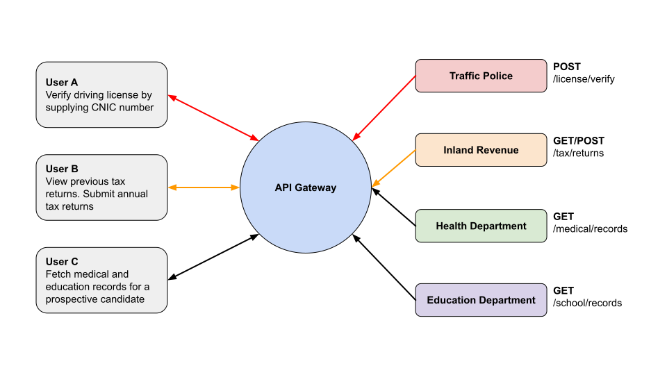

# Introduction to Rehnuma

**Access all KP Government digital services from a single location**

Rehnuma is an [API gateway](https://rehnuma.kpgov.tech) that sits between the citizens and backend services provided by each department. It acts as the primary aggregator and transformer for G2G and G2C services and provides a number of functions ranging from authentication to caching, throttling, and monitoring. 

## How it works

Rehnuma is an implementation of [KrakenD](https://krakend.io) which is a stateless, distributed, high-performance API Gateway that helps us effortlessly adopt microservices. It implements the **Backend for Frontend** and **Micro-frontends** patterns to eliminate the necessity of dealing with multiple REST services, isolating clients from the micro-service implementation details.

The core functionality is to act as an aggregator of many microservices into single endpoints, doing the heavy-lifting automatically including aggregation, transformation, filtering, decoding, throttling, authentication and more.

All Rehnuma endpoint configuration is stored in a plain text `.json` configuration file. This file consists of hundreds of endpoints that either connect directly to a specific departmental service, or provide some aggregated or transformed view of multiple services. 

## Building your APIs

If you already have a system in place, but there is no API for it, you will need to build one. Depending on the technology, you have a number of options when adding API endpoints to an existing system. 

- If your system is web-based, there is a good chance it is built on a web framework such as [ASP.Net](https://dotnet.microsoft.com/apps/aspnet), [Spring](https://spring.io/guides), [Django](https://docs.djangoproject.com/), [Laravel](https://laravel.com/docs/). Please refer to respective documentations on how to add or enable RESTful endpoints. 

- If you have a mobile app, there is a good chance you already have APIs available. If not, then the technologies identified above can be used to build new service endpoints. 

- If you have a desktop application, you will need to build a fresh set of APIs. The same web frameworks identified above can be used to build and deploy the new service endpoints. 

::: tip Important
Please refer to the documentation on [API Management](/technology/api/) to build your own service. 
:::

## Adding to service catalogue

In order for your API to be visible to other government services or to the public, it needs to be hosted on a server and listed in the service catalogue. 

::: tip Hosting Services
The KP IT Board provides hosting for all government services
:::

To add your service to the catalogue, please create an issue on our [GitHub repository](https://github.com/kpitb/service-catalogue). You will need to provide a link to the API, service description, and reference documentation. 

## Connecting to Rehnuma

Having your service listed in the catalogue is generally enough for it become available within the government. 

However, public access to your APIs is controlled by Rehnuma. Listing your service endpoints in Rehnuma makes it generally available for the public. All citizen services including mobile apps and websites must access KP Government services through Rehnuma. 

::: warning Note
All of the APIs and data sources recorded in the catalogue have their own licensing and access restrictions, check the documentation for each individual API for more details.
:::

To enable your service in Rehnuma
1. ensure its listing in the service catalogue
2. prepare your service configuration file on the [KrakenDesigner](https://designer.krakend.io/)
3. submit your configuration file to KPITB for approval and inclusion

If you have any questions or you are looking to set up a domain for your API, please [contact us](mailto:api@kpgov.tech).