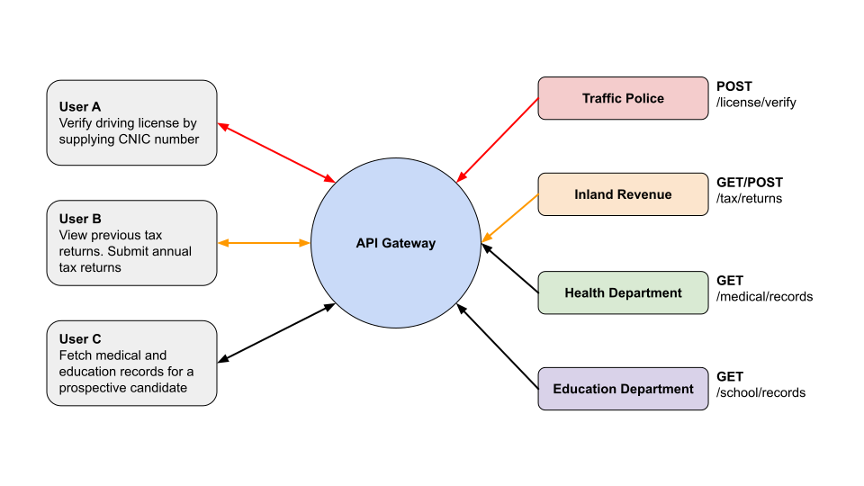

# System Architecture

KP's Digital Service uses an [API-first](https://swagger.io/resources/articles/adopting-an-api-first-approach/) approach for building citizen facing services. It encourages implementation of government services through loosely coupled APIs consumed by web and mobile applications via an API gateway ([Rehnuma](/services/rehnuma.html)). 

Authentication and authorization for the mobile and web apps is provided by an [OpenID](https://openid.net/connect) service called [Pehchaan](/services/pehchaan.html). 

An omni-channel communication service called [Paighaam](/services/paighaam.html) is used for sending emails and text messages to citizens. 

## API Gateway
The core functionality is to create an API that acts as an aggregator of many microservices into single endpoints, doing the heavy-lifting automatically including aggregation, transformation, filtering, decoding, throttling, authentication and more.

## Digital Identity
Pehchaan provides centralized authentication and authorization from the citizens. Government services subscribe to Pehchaan and request authorization from the user when their services are being used to access citizen data. 

1. User opens a web or mobile application, e.g. SuperApp
2. User logs in to the application using their Pehchaan ID
3. SuperApp requests access to their data from several government services
4. User authorizes access to SuperApp, Pehchaan returns a token to SuperApp
5. SuperApp uses token to access user data from government services

## Unified Communications
Paighaam is a unified communication service for the KP government. It can be used to send out emails, text messages, and push notifications to mobile apps and progressive web apps. The service is available as an API and can also be accessed from a web interface. It can only be used by government agencies and departments to notify and engage with citizens. 

